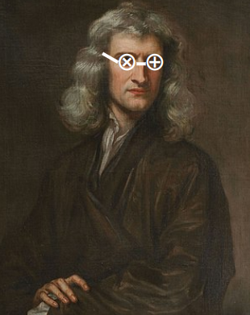

Solve fixpoint systems of equations over commutative semirings.

## Newton's Method

This package implements a solver based on Newton's method for solving fixpoint systems of equations, suitably generalized beyond real numbers to operate over semirings! The papers below are excellent examples of why Newton's method is awesome for solving the kinds of cyclical systems of equations that we encounter in probabilistic inference problems and other domains. Our implementation assumes that the semiring is commutative.

### References

* Details and discussion of semiring Newton's algorithm are in chapter 5 of [Tim Vieira's dissertation](https://timvieira.github.io/doc/2023-timv-dissertation.pdf)

* [An Extension of Newton's Method to ω-Continuous Semirings](https://link.springer.com/chapter/10.1007/978-3-540-73208-2_17). Javier Esparza, Stefan Kiefer, Michael Luttenberger

* [Recursive Markov chains, stochastic grammars, and monotone systems of nonlinear equations](https://dl.acm.org/doi/10.1145/1462153.1462154). Kousha Etessami, Mihalis Yannakakis

* [Computing partition functions of PCFGs](https://mjn.host.cs.st-andrews.ac.uk/publications/2008d.pdf). Mark-Jan Nederhof, Giorgio Satta

* [Exact Recursive Probabilistic Programming](https://arxiv.org/abs/2210.01206). David Chiang, Colin McDonald, Chung-chieh Shan

